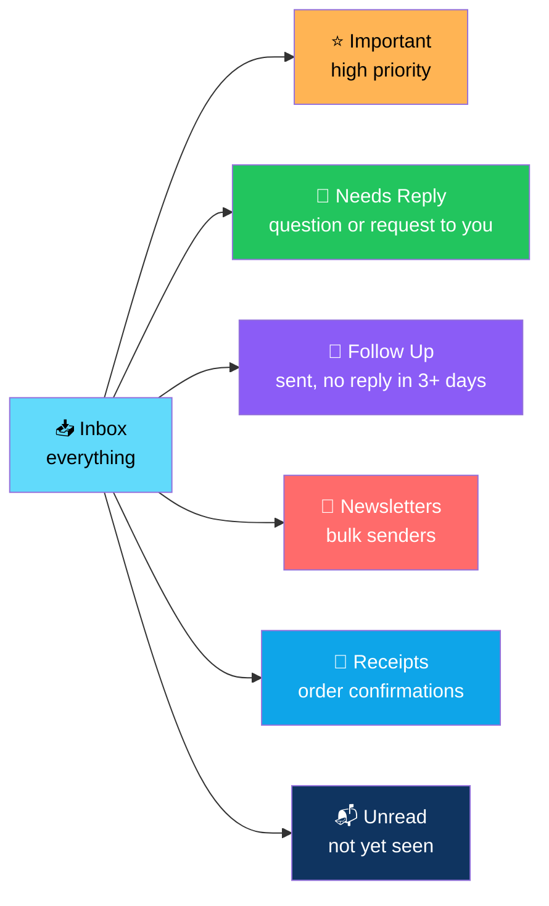
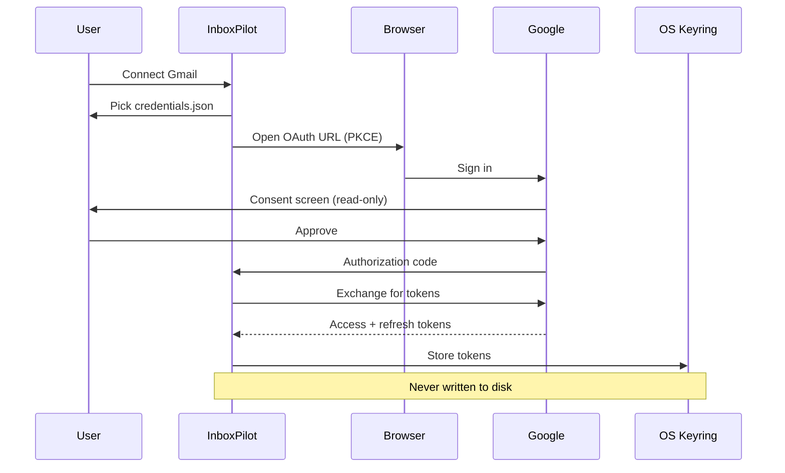
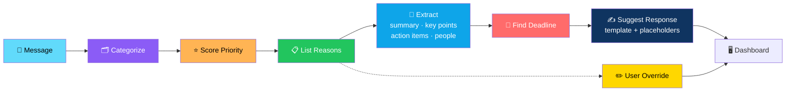
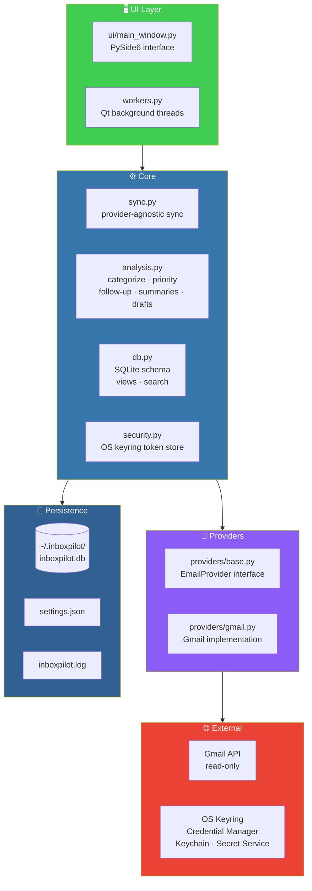

# 📧 InboxPilot — Email Command Center

<div align="center">


**Your inbox, sorted the way you actually think.**

*Inbox · Important · Needs Reply · Follow Up · Newsletters · Receipts · Unread*

[🔒 Privacy Model](#-privacy--safety-model) • [🚀 Setup](#-google-setup-one-time) • [🧠 How Analysis Works](#-how-the-analysis-works-and-its-limits) • [🏗️ Architecture](#️-architecture) • [🧪 Tests](#-tests)

</div>

---

## 📖 Overview

**InboxPilot** is a **desktop app** *(Python 3.11+, PySide6, SQLite)* that syncs your Gmail inbox **read-only** and turns it into a **prioritized dashboard**.

### Core Idea

> **Your email, sorted by what matters — with every decision traceable to the text that produced it.**
>
> Rule-based and deterministic. No black box. No third-party services. No password ever requested.

### The Dashboard



---

## 🔒 Privacy & Safety Model

> **This is the most important part of InboxPilot.**

<div align="center">

| Guarantee | How It's Enforced |
|-----------|------------------|
| **No password ever requested or stored** | **Official Gmail API + OAuth 2.0** — browser sign-in, PKCE |
| **Technically unable to modify your mail** | **Read-only scope** *(`gmail.readonly`)* — the app **cannot** send, delete, archive, or modify mail |
| **Tokens stay in the OS credential store** | **Windows Credential Manager** / **Keychain** / **Secret Service**. If none is available, the app **refuses to store tokens** rather than writing them to disk |
| **Clean disconnect** | Revokes the token at Google, deletes it locally, and optionally **wipes the local mail cache** |
| **Analysis runs locally** | **No email content is sent to any third-party service** |
| **Drafts stay local** | Drafts are only text in the app — **Edit / Copy / Save Draft**. Saved drafts live in the **local database**, not in Gmail |

</div>

### 🔐 The Auth Flow



---

## 🚀 Google Setup (One Time)

### 1. Create a Cloud Project

**Google Cloud Console** → create a project → **APIs & Services → Library** → enable **Gmail API**.

### 2. Configure the OAuth Consent Screen

- **External**
- Add **yourself** as a *Test user*
- Add scope: `.../auth/gmail.readonly`

### 3. Create Credentials

**Credentials → Create credentials → OAuth client ID → Desktop app** → download **`credentials.json`**.

### 4. Connect InboxPilot

1. Start InboxPilot
2. Click **Connect Gmail**
3. Pick **`credentials.json`**
4. **Sign in in your browser**

> 🔒 **`credentials.json` identifies the app, not you.**
>
> **Keep it out of version control.**

---

## ▶️ Run

```bash
python -m venv .venv
.venv\Scripts\activate              # Windows
# source .venv/bin/activate         # macOS/Linux

pip install -r requirements.txt
python run.py
```

### 💾 Where Data Lives

**Everything lives in `~/.inboxpilot/`:**

| File | Contents |
|------|----------|
| `inboxpilot.db` | Local mail cache and drafts |
| `settings.json` | App settings |
| `inboxpilot.log` | Log file |

**Override with:** `INBOXPILOT_HOME`

---

## 🧠 How the Analysis Works (and Its Limits)

> **Rule-based and deterministic — so every result is traceable to text in the message.**

### ⭐ Priority

**High / Medium / Low** from a score. The UI lists **every reason**:

**Positive signals:**

- ✓ Direct recipient
- ✓ Requested action
- ✓ Question
- ✓ Deadline
- ✓ Urgent wording
- ✓ Prior correspondence

**Negative signals:**

- – Bulk / automated sender

> 💡 **Override anytime.**

### 💬 Needs Reply

A **question or request addressed to you**, from a **non-automated sender**, with **no later sent message in the thread**.

### 🔁 Follow Up

**Your sent messages with no reply after 3+ days.**

### 📅 Deadline

- The **exact phrase found** *(e.g. "by Friday")*
- Or **`No deadline identified.`**

### 📝 Extracted Fields

| Field | Source |
|-------|--------|
| **Summary** | Extracted from message text |
| **Key points** | Extracted from message text |
| **Action items** | Extracted from message text |
| **People** | Extracted from message text |

> 💡 **Empty sections say so** — no invented content.

### ✍️ Suggested Response

A **template** with `[placeholders]` for anything the app **cannot know**.

### ⚠️ Heuristics Make Mistakes

- Sarcasm
- Other languages
- Unusual phrasing

> 💡 **Hence category / priority overrides.**

### 🤖 AI Is Optional — and Not Wired In

> **The optional AI API is NOT wired in.**
>
> **`analysis.summarize()`** and **`generate_draft()`** are the **seams to replace** if you want to add one.

### Analysis Pipeline



---

## 🏗️ Architecture

### System Overview



### 🗂️ Layout

```
inboxpilot/
├── providers/
│   ├── base.py         EmailProvider interface
│   └── gmail.py        Gmail implementation
├── analysis.py         categorize, priority, follow-up, summaries, drafts
├── db.py               SQLite schema, views, search
├── sync.py             provider-agnostic sync
├── security.py         OS keyring token store
├── workers.py          Qt background threads
└── ui/
    └── main_window.py  PySide6 interface
```

### 🔌 Adding a Provider

**Example: Outlook via Microsoft Graph**

1. **Subclass `EmailProvider`**
2. **Register it** in `providers/__init__.py:create_provider`
3. **Give message ids a `"<provider>:"` prefix**

### Design Principles

<div align="center">

| Principle | Implementation |
|-----------|---------------|
| **🔒 Read-only by design** | `gmail.readonly` scope — the app is technically unable to modify mail |
| **🔐 Secrets stay in the OS keyring** | Refuses to store tokens on disk if no keyring is available |
| **🏠 Local-first analysis** | No email content leaves the machine |
| **🧠 Deterministic, traceable rules** | Every priority has a listed reason — nothing is a black box |
| **✍️ Drafts stay local** | Saved in the SQLite DB, never in Gmail |
| **🔌 Provider-agnostic core** | `EmailProvider` is the interface; Gmail is one implementation |
| **🚫 No AI required** | `summarize()` and `generate_draft()` are documented seams — the app works fully without them |
| **💡 Overrides everywhere** | Heuristics make mistakes — category and priority are user-adjustable |
| **🧪 Standard-library-friendly tests** | Runs with `pytest`, includes a headless UI smoke test |

</div>

---

## 🧪 Tests

```bash
pip install -r requirements-dev.txt
pytest
```

### What's Covered

<div align="center">

| Area | Coverage |
|------|:--------:|
| **Analysis rules** | ✅ |
| **DB filters / overrides / reply logic** | ✅ |
| **Incremental sync** — with a fake provider | ✅ |
| **Gmail message parsing** | ✅ |
| **Headless UI smoke test** | ✅ — *set `QT_QPA_PLATFORM=offscreen` on servers* |

</div>

---

## 📦 Windows Packaging

**In a venv with `requirements-dev.txt`:**

```bat
build_windows.bat
```

**Output:** `dist\InboxPilot\InboxPilot.exe` *(PyInstaller, windowed)*

> 💡 **Wrap the folder with [Inno Setup](https://jrsoftware.org/isinfo.php) for an installer if desired.**

---

## ⚠️ Known Limitations

<div align="center">

| Limitation | Details |
|-----------|---------|
| **Gmail only for now** | Syncs the latest **N** *(default 300)* inbox and sent messages per run — `sync_limit` in `settings.json` |
| **New messages only** | Only new messages are downloaded. Read/unread state is refreshed each sync — **edits to old messages are not** |
| **Not yet verified against a live Google account** | In this build environment — see [Google setup](#-google-setup-one-time) to try it |

</div>

---

## 🗺️ Roadmap

### ✅ Current

- [x] Gmail sync via official API with OAuth 2.0 + PKCE
- [x] Read-only scope — no send, delete, archive, or modify
- [x] Tokens stored in OS credential store
- [x] Refuses to store tokens on disk if no keyring is available
- [x] Disconnect revokes token at Google and optionally wipes local cache
- [x] Local-only analysis — no third-party services
- [x] Seven dashboard views — Inbox, Important, Needs Reply, Follow Up, Newsletters, Receipts, Unread
- [x] Priority scoring with listed reasons and user override
- [x] Needs Reply detection
- [x] Follow Up detection (sent, no reply, 3+ days)
- [x] Deadline extraction with exact phrase
- [x] Summary / key points / action items / people extraction
- [x] Suggested response templates with placeholders
- [x] Local draft storage — Edit / Copy / Save Draft
- [x] SQLite persistence with search
- [x] Background workers via Qt threads
- [x] `EmailProvider` abstraction with Gmail implementation
- [x] PySide6 native UI
- [x] PyInstaller packaging script
- [x] Test suite with pytest and headless UI smoke test

### 🔜 Future Ideas

- [ ] **Outlook provider** — Microsoft Graph
- [ ] **AI integration** — wire `summarize()` and `generate_draft()` to an optional provider
- [ ] **Thread view** — conversation-level navigation
- [ ] **Saved searches** — reusable filter presets
- [ ] **Bulk actions** — mark read, tag, snooze *(requires scope expansion)*
- [ ] **Notification center** — surface Needs Reply in the background
- [ ] **Multi-account support**
- [ ] **Labels and tags** — mirror Gmail labels in the UI
- [ ] **Search syntax** — Gmail-style query support
- [ ] **Export** — inbox digest as CSV or markdown

---

## 🤝 Contributing

Contributions are welcome. Please:

1. Fork the repository
2. **Keep the read-only guarantee** — never request write scopes
3. **Keep analysis local** — no email content to third parties
4. **Keep rules deterministic and traceable** — every priority needs a listed reason
5. **Use the `EmailProvider` interface** for new providers
6. **Refuse to store tokens without a keyring** — this is a feature
7. **Add tests for any new analysis rule**
8. Submit a Pull Request

### Guidelines

- **Never request your password** — OAuth only, always
- **Never write tokens to disk** — keyring or nothing
- **Never leave Gmail data behind on disconnect** — revoke at Google *and* clear locally
- **Never fabricate content** — empty sections must say so
- **Never remove the AI seams** — they're documented extension points
- **Never break existing `settings.json`** without a migration path

---

## 📜 License

MIT — see [LICENSE](LICENSE) for details.

---

## 🙏 Acknowledgments

- **Google** — for a Gmail API that respects read-only scopes
- **PySide6** — for a desktop UI that feels native
- **Every inbox that's ever made someone feel behind** — this one's for you

---

<div align="center">

### 📧 SYNC. SORT. TRIAGE. REPLY.

**Your inbox, sorted the way you actually think.**

**Read-only. Local analysis. No password ever requested.**

<br>

⭐ If InboxPilot helped you, consider giving it a star.

<br>

[⬆ Back to Top](#-inboxpilot--email-command-center)

</div>
